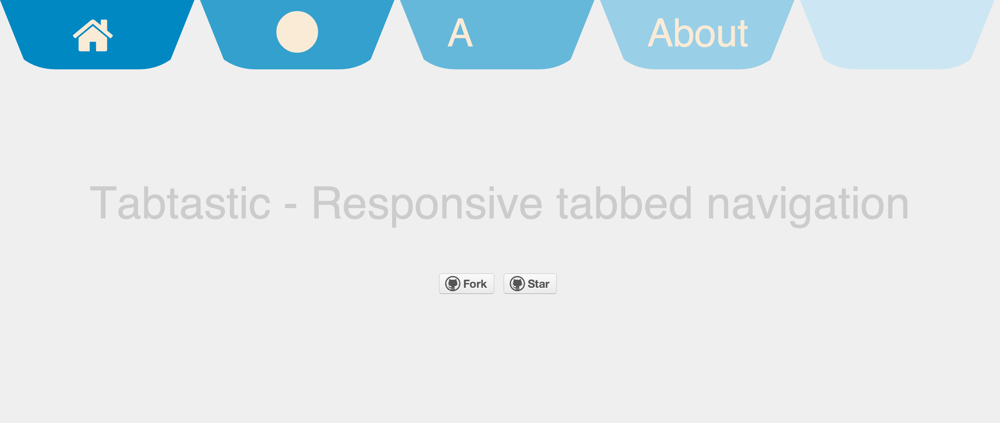

tabtastic
=========

Tabtastic began at Ship it! Saturday, a one day [Launch Academy](http://launchacademy.com) hackathon. It's an experiment in interaction design for mobile devices using a single page to present multiple pages of information on a small screen. Tabtastic is a work in progress. Check out the [demo site](http://alnoorpirani.com/tabtastic) to see how it works.

